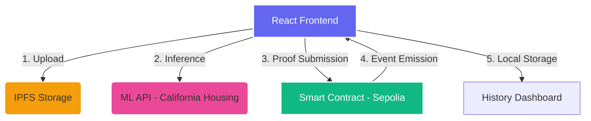

# 🛡️ ZK-Verify Platform  
### *End-to-End Zero-Knowledge Verified Machine Learning Inference System*

---

## 📌 Project Vision
**ZK-Verify** is a state-of-the-art Web3 platform designed to address the "Black Box" problem in AI. By bridging high-performance ML inference with decentralized trust, we enable users to verify that a prediction was generated by a specific model using specific inputs, without relying on a centralized intermediary.

> [!IMPORTANT]
> **Core Innovation**: We combine **IPFS** for data integrity, **ML APIs** for speed, and **Blockchain** for immutable verification, creating a "Trustless Audit Trail" for AI.

---

## 🚀 The Value Proposition
| 🔍 **Decentralized** | 🛡️ **Verifiable** | 📊 **Transparent** |
| :--- | :--- | :--- |
| No single point of failure. Data lives on IPFS. | Cryptographic proof-like validation on-chain. | Every prediction is archived and auditable. |

---

## 🏗️ System Architecture
The platform orchestrates a complex flow between four distinct layers:



---

## 🛠️ Step-by-Step Experience

### 1️⃣ Identity & Connection
Our journey begins with secure authentication. We integrate directly with **MetaMask** to establish a verifiable user identity.

*   **Action**: Connect MetaMask.
*   **Outcome**: User address (e.g., `0x7d13...a205`) is linked to the session.

### 2️⃣ Decentralized Data Anchoring (IPFS)
Users upload their **Model Config** and **Inference Inputs**. These are not just stored in a database; they are pinned to **IPFS**, ensuring they can never be silently modified.

> [!TIP]
> **Data Integrity**: By using CIDs (`Qm...`), we ensure that the model used for any on-chain verification is exactly the one the user intended.

### 3️⃣ Real-Time ML Inference
The system fetches a prediction from our optimized ML engine (trained on the California Housing dataset).

*   **Model**: Random Forest / Linear Regression.
*   **Result**: Instant housing price prediction with 6-decimal precision.

### 4️⃣ The "Trustless" Protocol (On-Chain Submission)
This is where the magic happens. We transform the off-chain result into an on-chain verification event.


**Verification Logic:**
```solidity
submitProof(
  string modelCID,    // IPFS Link to Model
  string inputCID,    // IPFS Link to Input
  uint256 modelHash,  // Deterministic identifier
  uint256 inputHash,  // Deterministic identifier
  uint256 output,     // Scaled prediction value
  bytes32 pA, ...     // Cryptographic proof parameters
)
```

---

## 📊 Verification Dashboard & Audit History
Transparency is at the heart of ZK-Verify. Users can audit every single job submitted to the platform.


| Field | Description | Importance |
| :--- | :--- | :--- |
| **Transaction Hash** | Immutable link to Sepolia Explorer | Proof of execution |
| **IPFS CIDs** | Decentralized data references | Non-repudiation |
| **Trust Score** | Calculated reliability metric | User confidence |
| **Status Badge** | Verified ✅ | Cryptographic certainty |

---

## 🛡️ Robust Security & Error Handling

We implement a multi-layered validation engine to prevent invalid or malicious data from reaching the blockchain.

> [!WARNING]
> **Rejection Logic**: If a model is blacklisted or its hash doesn't match the circuit, the system blocks submission before gas is wasted.

| Scenario | System Response |
| :--- | :--- |
| Incorrect Model File | `model_false.json` ❌ Rejected |
| Missing Features | `Must include 8 features` API error |
| No Wallet | `Connect MetaMask first` warning |

---

## ✨ Key Technical Highlights
*   **Dynamic Circuits**: Handles variable model configurations via IPFS hashing.
*   **Precision Scaling**: Uses a 1,000,000x multiplier to handle float values in Solidity.
*   **Auditability**: Dual-layer storage (Local + Blockchain) for high availability.
*   **User Empowerment**: Provides a "Proof Details" modal for transparency into every bite of data.

---

## 🎉 Conclusion
**ZK-Verify** isn't just a dApp; it's a blueprint for the future of **Verifiable AI**. By combining the raw power of Machine Learning with the unyielding trust of Blockchain, we ensure that the algorithms of tomorrow are fair, transparent, and provably correct.

---
**Built with ❤️ for the future of Trustless Intelligence.**
